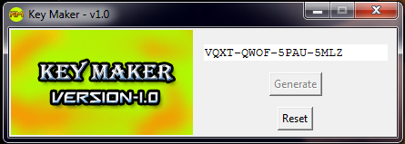

#  Key Maker
A small GUI tool to generate serial keys of 16 digit length.
<br/>


### Description
This is a small utility GUI Program written in python to generate serial key strings of 16 digit length which will contain characters A-Z and 0-9
picked in a random manner.

It is Just an experimental mini project to fiddle with Tkinter GUI toolkit, python Random module and string manipulation in python.

### Usage Scenario
The tool can be used to create digital serial keys.

### Build Method:
CX-freeze is used to build distributable .exe file

### Steps To Build exe
Run the following command from the terminal
```
python setup.py build
```
It will create a folder named build with the distributable contents targeted for a windows 64 bit machine.
In order to build for other machines or to change the setup configurations, please modify the setup.py script.
